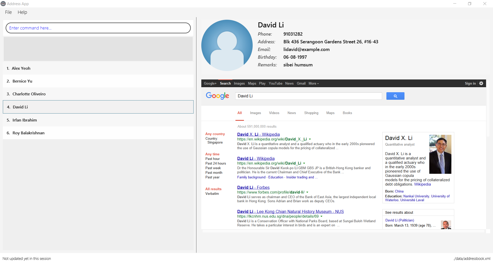

= Address Book (Level 4)
ifdef::env-github,env-browser[:relfileprefix: docs/]
ifdef::env-github,env-browser[:outfilesuffix: .adoc]

https://travis-ci.org/se-edu/addressbook-level4[image:https://travis-ci.org/se-edu/addressbook-level4.svg?branch=master[Build Status]]
https://ci.appveyor.com/project/damithc/addressbook-level4[image:https://ci.appveyor.com/api/projects/status/3boko2x2vr5cc3w2?svg=true[Build status]]
https://coveralls.io/github/se-edu/addressbook-level4?branch=master[image:https://coveralls.io/repos/github/se-edu/addressbook-level4/badge.svg?branch=master[Coverage Status]]
https://www.codacy.com/app/damith/addressbook-level4?utm_source=github.com&utm_medium=referral&utm_content=se-edu/addressbook-level4&utm_campaign=Badge_Grade[image:https://api.codacy.com/project/badge/Grade/fc0b7775cf7f4fdeaf08776f3d8e364a[Codacy Badge]]

ifdef::env-github[]

endif::[]

ifndef::env-github[]
image::images/Ui.png[width="600"]
endif::[]

* PocketBook is a Text-based contacts management applicationdeveloped by us. We are a team of NUS undergraduate students from different school and faculties.
* The application is targetted at students and working adults to keep track and to extract details of their contacts through their daily applications.
* This is a desktop PocketBook application. It has GUI but most of the user interactions are expected to be implemented using Command Line interface.
** Support for _Build Automation_ using Gradle and for _Continuous Integration_ using Travis CI.

== Site Map

* <<UserGuide#, User Guide>>
* <<DeveloperGuide#, Developer Guide>>
* <<AboutUs#, About Us>>
* <<ContactUs#, Contact Us>>

== Acknowledgements

* Some parts of this sample application were inspired by the excellent http://code.makery.ch/library/javafx-8-tutorial/[Java FX tutorial] by
_Marco Jakob_.
* The project is designed by Professor Damith C. Rajapakse and his team from [School of Computing, National University of Singapore](http://www.comp.nus.edu.sg).
* The project is morphed based on [AddressBook-Level4](https://github.com/nus-cs2103-AY1617S1/addressbook-level4) prepared by the teaching team.

== Licence : link:LICENSE[MIT]
